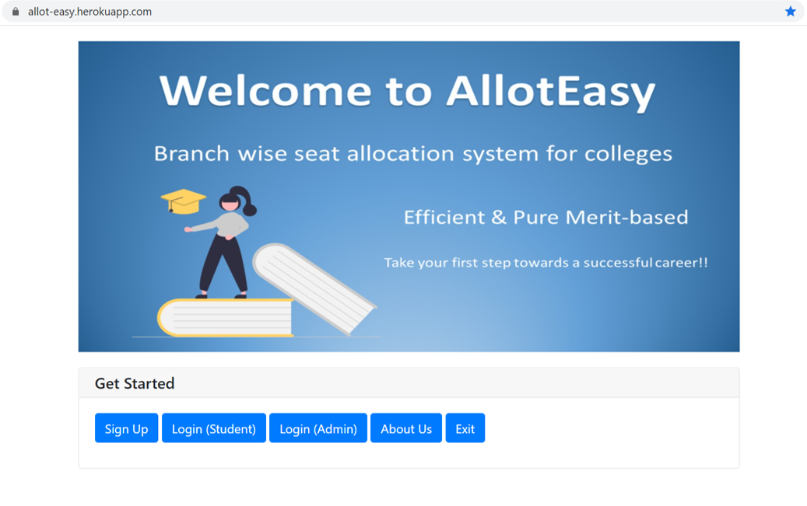
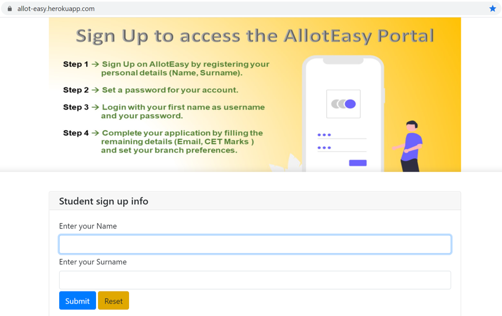
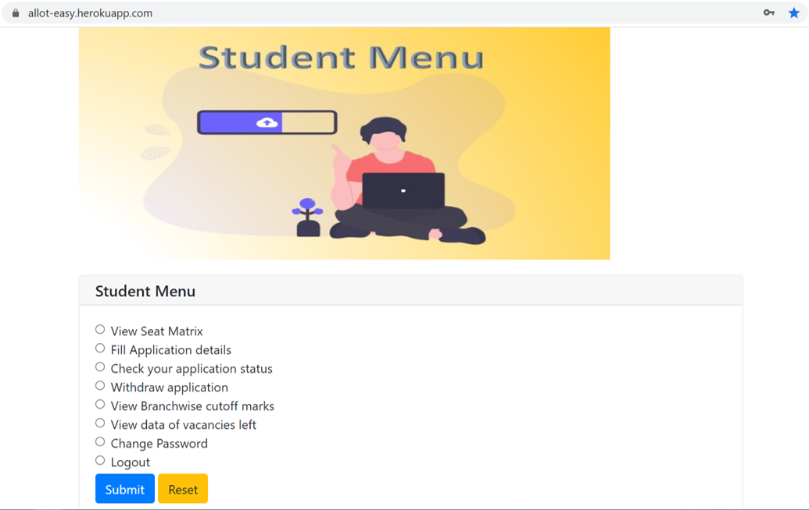
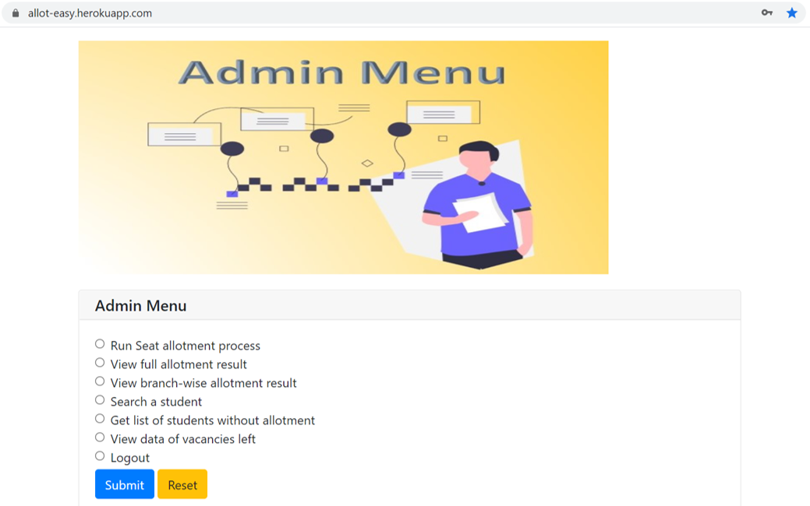

# Allot Easy

This is an *application based* group project as a part of the Buffer 2.0 project series organised by Team Loop of Cummins College of Engineering, Pune. 
Visit our [website] to view the project or view the [Demo video]

---
### What is the project objective?
This project aims to **simulate the admission process** for Engineering Colleges at the State level. Students can apply for a degree program at an engineering college using this system. Allot Easy is a completely merit based allotment system. Students are admitted taking in consideration their Common Entrance Test (CET) marks and course preferences.

----
#### Allot Easy Web App Screenshots

<table>
  <tr>
    <td>Login page</td>
     <td>Sign up page</td>
  </tr>
  <tr>
    <td></td>
    <td></td>
  </tr>
  <tr>
     <td>Student Menu page</td>
     <td>Admin Menu page</td>
  </tr>
  <tr>
    <td></td>
    <td></td>
  </tr>
 </table>

### Features:
The code is divided into different classes: menu, database, allotment_mechanism. 
Each file contains a class which has the related data members and functions defined in it. 
The functionality is divided mainly into 2 parts: For **Admin** and **Student**. 
There are different functionalities available to the user depending upon whether he/she is an Admin or a Student. Validations are added for all inputs to ensure an error free experience.
The system carries out seat allocation efficiently for 500+ student records currently present in the database.
**Passwords are encrypted** with a simple caesar-cipher algorithm before saving in the datasheet.

**Functions available for Students:**
- **Sign Up** :  
A new Student has to register and set his username and password before he can log into the application and access more features. 
The password can be changed later by logging into the account.
- **Login for Students** : 
Student has to log into the application with his username and password.
- **Fill Application details** : 
Students can update their application with their perosnal details (gender, email-id), marks, and course preferences. Students can reset their course preferences any number of times before the allotment process is done. 
(This functionality is available only till the allotment process is executed by Admin)
- **View seat matrix** : 
Students can view the number of available seats of all courses offered by the college.
- **Check application status** : 
Students can view their saved application details and check the allotment status: application incomplete / allotment pending / allotment result.
- **Withdraw application** : 
Student can choose to withdraw his/her application which will delete all the saved details and the student gets logged out of his account automatically.
(This functionality is available only till the allotment process is executed by Admin)
- **View cutoff marks** : 
Students can view the cut off marks of various Engineering Courses that the college offers. (This functionality is available only *after* the Admin has run the allotment process)
- **Get vacancy data** : 
Students can view the vacancies left after allotment is done, for each course offered by the college. 

**Functions available for Admin:**
- Admin can **Run the allotment** process after which the students are admitted to a course of their preference. Admin can also **reset** the allotments if needed.
- Admin can **view the details** of any Student who has applied to the college.
- Admin can **view the full allotment result**, where all the applicants are listed with their alloted course name.
- Admin can **get course wise allotment list** of students.
- Admin can **get the count and list** of students who **haven't been alloted** any seat.
- Admin can **view the data of vacancies** left after allotment process.

---
**Programming Language:**  Python  
**Data Structures used:**  Dictionary, List, List of dictionaries, List of lists (2D Array)  
**Libraries used:**  
- pandas (for handling of csv data)
- csv  (for reading and writing to csv file)
- pywebio (for GUI)
- flask (for deployment of the web app)

---
### What's next?
We will continue updating the project with additional features such as
- Forgot Password- A new temporary password will be emailed to the user.
- Password encryption by using a stronger algorithm.
- Validation of score entered by applicant by extracting the score from the uploaded scorecard in pdf form.
- Feature for students that allow them to download their allotment result as a pdf file and Admin feature to download the full allotment result list in the form of pdf.
- Course seat prediction, based on score by using ML algorithms.
- Show statistics such as acceptance rate per course, gender wise allocation chart, etc.
- Executing multiple allotment rounds - students will have the option to accept and freeze the alloted seat or try again for betterment in the next round.

[//]: # (These are reference links used in the body of this note and get stripped out when the markdown processor does its job. There is no need to format nicely because it shouldn't be seen. Thanks SO - http://stackoverflow.com/questions/4823468/store-comments-in-markdown-syntax)

   [website]: <https://allot-easy.herokuapp.com/>
   [Demo video]: <https://youtu.be/Kn9ufMtAcJc>

